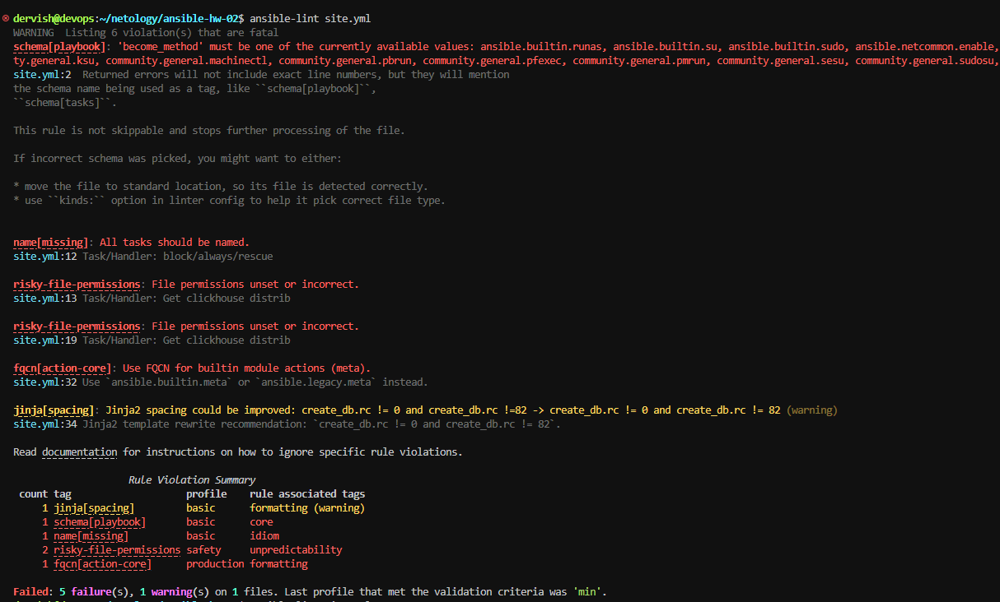
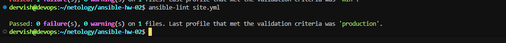
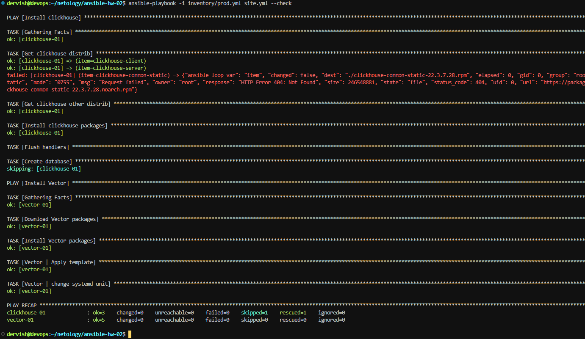
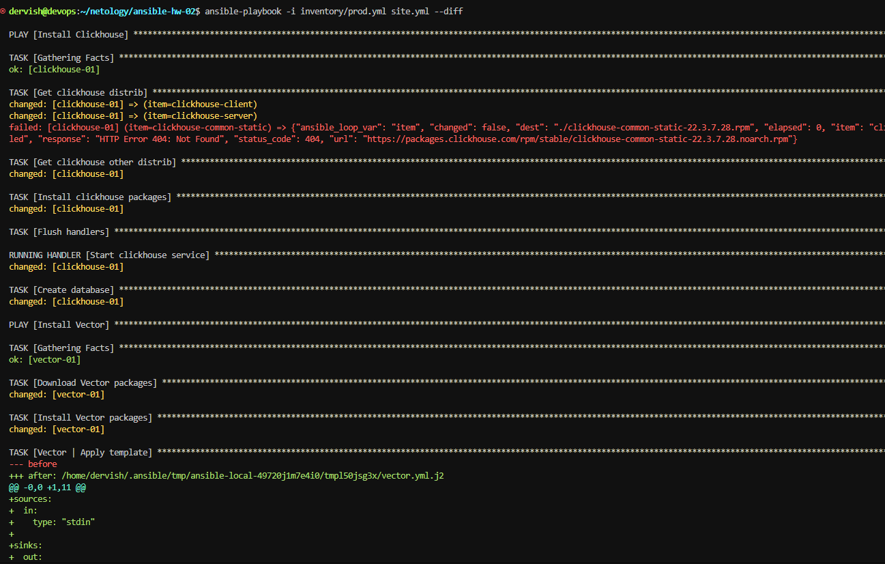
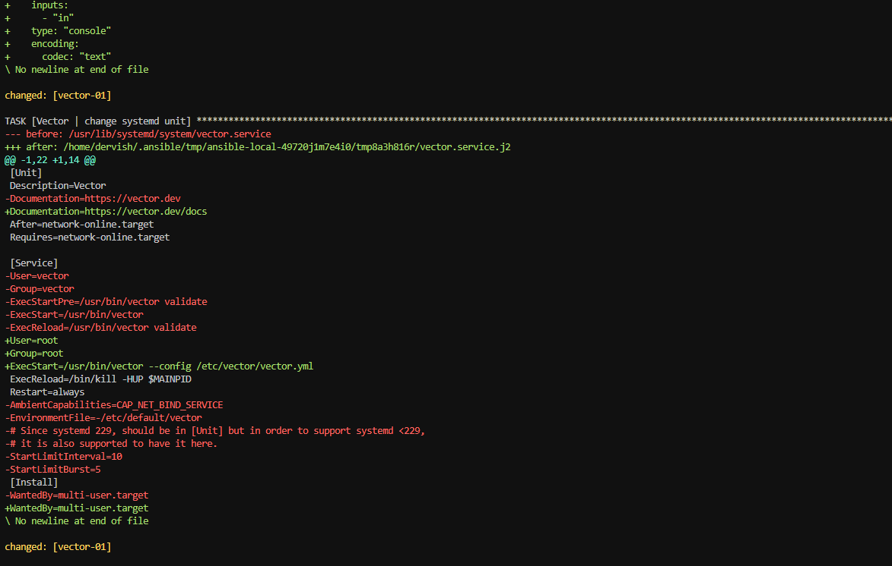
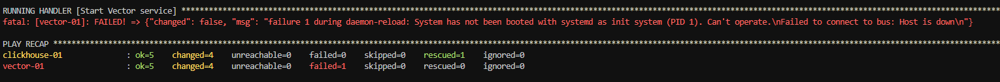
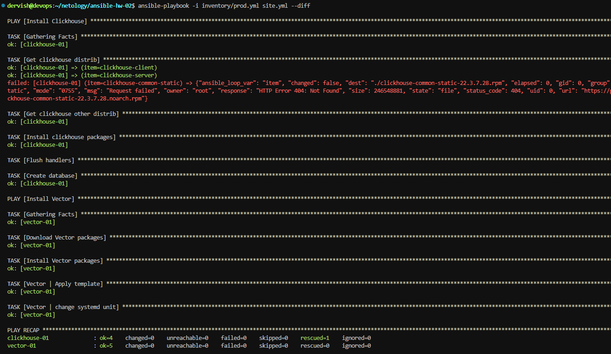

## Задача 1

1. Подготовьте свой inventory-файл prod.yml.

>Ответ: [prod.yml](./inventory/prod.yml)

2. Допишите playbook: нужно сделать ещё один play, который устанавливает и настраивает vector. Конфигурация vector должна деплоиться через template файл jinja2. От вас не требуется использовать все возможности шаблонизатора, просто вставьте стандартный конфиг в template файл. Информация по шаблонам по ссылке. не забудьте сделать handler на перезапуск vector в случае изменения конфигурации!
3. При создании tasks рекомендую использовать модули: get_url, template, unarchive, file.
4. Tasks должны: скачать дистрибутив нужной версии, выполнить распаковку в выбранную директорию, установить vector.

>Ответ: [site.yml](./site.yml), [vector.yml.j2](./templates/vector.yml.j2)

5. Запустите ansible-lint site.yml и исправьте ошибки, если они есть.

>Исправляем все найденные ошибки и снова проверяем

6. Попробуйте запустить playbook на этом окружении с флагом --check.

7. Запустите playbook на prod.yml окружении с флагом --diff. Убедитесь, что изменения на системе произведены.

8. Повторно запустите playbook с флагом --diff и убедитесь, что playbook идемпотентен.

9. Подготовьте README.md-файл по своему playbook. В нём должно быть описано: что делает playbook, какие у него есть параметры и теги. Пример качественной документации ansible playbook по [ссылке](https://github.com/opensearch-project/ansible-playbook). Так же приложите скриншоты выполнения заданий №5-8

>Файл [README.md](./README.md), скриншоты разместил выше по тексту.

10. Готовый playbook выложите в свой репозиторий, поставьте тег 08-ansible-02-playbook на фиксирующий коммит, в ответ предоставьте ссылку на него.