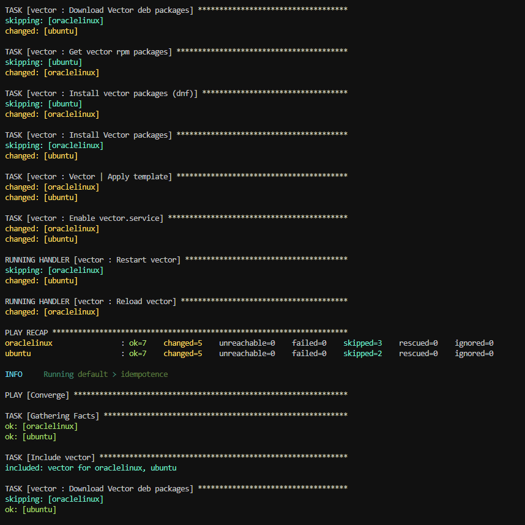
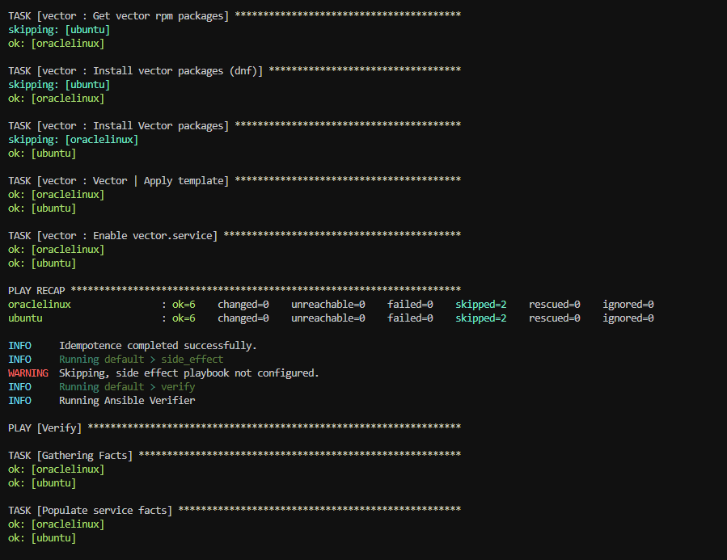
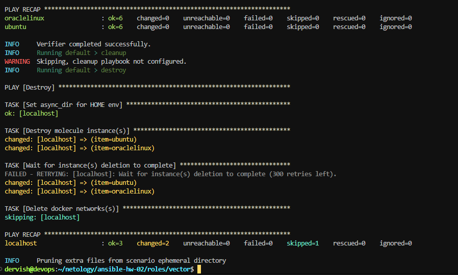

## Molecule

1. Запустите molecule test -s ubuntu_xenial (или с любым другим сценарием, не имеет значения) внутри корневой директории clickhouse-role, посмотрите на вывод команды. Данная команда может отработать с ошибками или не отработать вовсе, это нормально. Наша цель - посмотреть как другие в реальном мире используют молекулу И из чего может состоять сценарий тестирования.

2. Перейдите в каталог с ролью vector-role и создайте сценарий тестирования по умолчанию при помощи molecule init scenario --driver-name docker.

3. Добавьте несколько разных дистрибутивов (oraclelinux:8, ubuntu:latest) для инстансов и протестируйте роль, исправьте найденные ошибки, если они есть.

>Исправляем найденные ошибки

4. Добавьте несколько assert в verify.yml-файл для проверки работоспособности vector-role (проверка, что конфиг валидный, проверка успешности запуска и др.).
5. Запустите тестирование роли повторно и проверьте, что оно прошло успешно.

6. Добавьте новый тег на коммит с рабочим сценарием в соответствии с семантическим версионированием.

`git tag -a 1.0.7 -m "1.0.7"`

`git push origin 1.0.7`

>Ответ: [vector role](https://github.com/ua4wne/vector-role/)

## Tox

1. Добавьте в директорию с vector-role файлы из [директории](https://github.com/netology-code/mnt-homeworks/blob/MNT-video/08-ansible-05-testing/example).
<<<<<<< HEAD
2. Запустите docker run --privileged=True -v <path_to_repo>:/opt/vector-role -w /opt/vector-role -it aragast/netology:latest /bin/bash, где path_to_repo — путь до корня репозитория с vector-role на вашей файловой системе.

> ` docker run --privileged=True -v ./vector-role:/opt/vector-role -w /opt/vector-role -it aragast/netology:latest /bin/bash `

3. Внутри контейнера выполните команду tox, посмотрите на вывод.

4. Создайте облегчённый сценарий для molecule с драйвером molecule_podman. Проверьте его на исполнимость.

5. Пропишите правильную команду в tox.ini, чтобы запускался облегчённый сценарий.

>` commands =  {posargs:molecule test -s light --destroy always} `

6. Запустите команду tox. Убедитесь, что всё отработало успешно.

7. Добавьте новый тег на коммит с рабочим сценарием в соответствии с семантическим версионированием.

`git tag -a 1.0.8 -m "1.0.8"`

`git push origin 1.0.8`
=======
2. Запустите docker run --privileged=True -v <path_to_repo>:/opt/vector-role -w /opt/vector-role -it aragast/netology:latest /bin/bash, где path_to_repo — путь до корня репозитория с vector-role на вашей файловой системе.
>>>>>>> 204ca3d39a87009bfa35e699f585beca70f72a40
